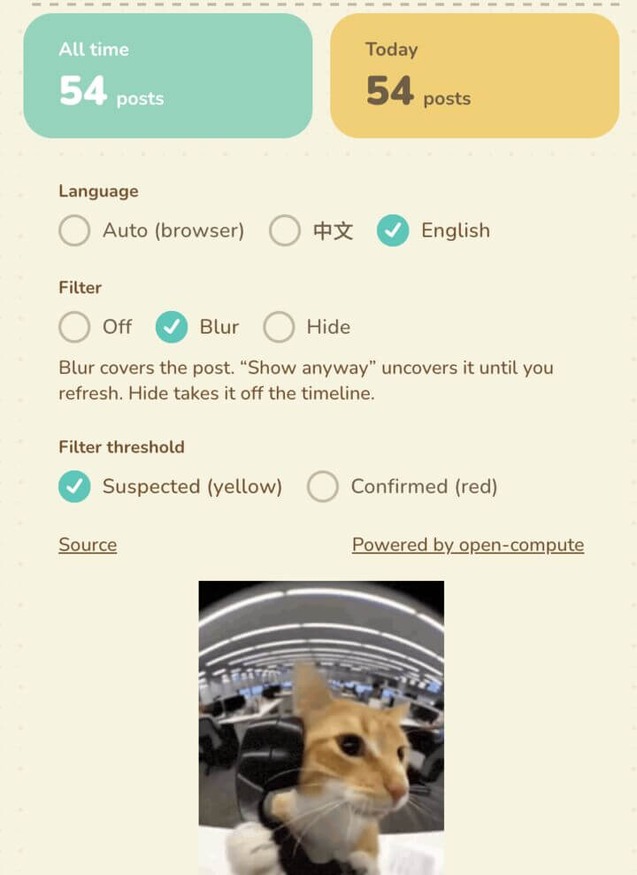

<p align="center">
  
</p>

# Tweet 911

[English](README.md) | **中文**

Chrome 扩展，在 X 上实时给帖子和回复打分：

- **AI 味** — 像不像大模型写的
- **色情引流** — 约炮、导流、把人往站外带
- **复读机** — 回复只是换词复述楼主

判断会把作者信息（用户名、昵称、简介）和正文放在一起看；回复还会带上楼主原文。

## 预览

<p align="center">
  
</p>
<p align="center">
  
</p>

## 安装

Chrome 网上应用店还在上架中。现在从 GitHub Releases 手动装：

1. 下载 **[tweet-911-chrome.zip](https://github.com/elliothux/tweet-911/releases/latest/download/tweet-911-chrome.zip)**（[全部版本](https://github.com/elliothux/tweet-911/releases)）
2. 解压
3. 打开 `chrome://extensions`
4. 打开右上角 **开发者模式**
5. **加载已解压的扩展程序**，选中解压后的文件夹（里面要有 `manifest.json`）
6. 打开 [x.com](https://x.com)

每次推送 `v*` 标签，GitHub Actions 都会打 zip 并挂到该次 Release 的 Assets 上。

## 架构

打分 API 是标准的 [Cloudflare Workers](https://developers.cloudflare.com/workers/) 兼容 Worker。**整份 Worker 跑在 [open-compute](https://github.com/elliothux/open-compute) 上** — 这是开源、可自托管、兼容 Workers 编程模型（workerd、Wrangler、KV 等）的平台。

扩展不会在浏览器里直连 TypeSafe。它在 x.com 上抽出帖子，`POST` 到 Worker。Worker 按 URL 把结果缓存在 KV；没命中的请求交给 [TypeSafe System One](https://typesafe.ai/blog/introducing-system-one-models-and-jev) 的 **Jev** 打分。

```
x.com 时间线
      │
      ▼
 Chrome 扩展（WXT + React）
      │  POST /v1/score  或  /v1/score/batch
      ▼
 tweet-911 worker（KV 缓存 + /v1/score）
      │  运行在 open-compute
      │  未命中
      ▼
 TypeSafe Jev
```

实时感来自帖子刚进视口（甚至还在屏幕外一两屏）就开始打分，并且按批发出去，通常你停在一条帖上时分数已经在了。

## 仓库

```
tweet-911/
├── icon.png
├── packages/
│   ├── extension/    Chrome MV3（WXT + React）
│   └── worker/       Workers 兼容 API（跑在 open-compute）
└── README.md
```

```bash
bun install
bun run dev              # 扩展 + Worker
bun run dev:extension    # 只跑 WXT
bun run dev:worker       # wrangler → http://127.0.0.1:8788
bun run test             # worker vitest
bun run extension:zip    # 给「加载已解压」用的 chrome zip
```

## 扩展

开发：`bun run dev:extension`（WXT 会拉起 Chrome）。本地打包：`bun run extension:zip` → `packages/extension/.output/tweet-911-chrome.zip`。

弹窗里可以改语言、模糊/隐藏、帖子和评论各自的屏蔽阈值，以及只存在浏览器本地的检测计数。

## Worker

和写给 Cloudflare 的 Wrangler 项目一样。本地用 `wrangler dev`，线上是这份 Worker 跑在 open-compute 上。

```bash
cd packages/worker
bunx wrangler secret put TYPESAFE_API_KEY
# 可选，给客户端加一把钥匙：
bunx wrangler secret put API_KEY
```

本地密钥：把 `.dev.vars.example` 复制成 `.dev.vars`。默认模型是 `jev-latest`。

| 方法 | 路径 | 说明 |
|------|------|------|
| `GET` | `/health` | `{ "ok": true }` |
| `POST` | `/v1/score` | 单条 |
| `POST` | `/v1/score/batch` | `{ "items": [ … ] }`，最多 50 条 |
| `OPTIONS` | `*` | 给 `chrome-extension://` 和 localhost 的 CORS |

`url` 必填（缓存键）。有正文或图片 URL 即可；能带上 `author`、`in_reply_to` 更好。

打分结果在 KV 里保留 **90 天**。每天 UTC 4:00 的 cron（`0 4 * * *`）会扫 `cache:url:*` 并删掉过期键，避免无限膨胀。读到过期条目也会当场丢掉。

分数是 0–1。标签阈值 0.65 / 0.35：`likely_ai` / `uncertain` / `likely_human`（色情和复读同一套）。

## 链接

- [TypeSafe System One 和 Jev](https://typesafe.ai/blog/introducing-system-one-models-and-jev)
- [open-compute](https://github.com/elliothux/open-compute)
- [最新扩展 zip](https://github.com/elliothux/tweet-911/releases/latest/download/tweet-911-chrome.zip)
- [源码](https://github.com/elliothux/tweet-911)

## License

MIT
